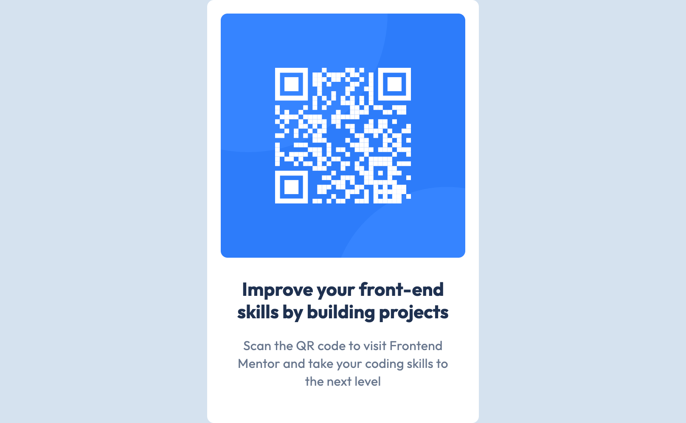

# Frontend Mentor - QR code component solution

This is a solution to the [QR code component challenge on Frontend Mentor](https://www.frontendmentor.io/challenges/qr-code-component-iux_sIO_H).

## Table of contents

- [Overview](#overview)
  - [Screenshot](#screenshot)
  - [Built with](#built-with)
  - [What I learned](#what-i-learned)
  - [Continued development](#continued-development)
  - [Useful resources](#useful-resources)
- [Author](#author)

## Overview
In this project I created a QR code card component using HTML and CSS. I practiced using semantic HTML and using a flexbox layout in CSS, using a figma design file for reference to simulate a front-end development workflow. This project required attention to detail, following design specifications, and using modern web development practices. The component includes an image of a QR code, a bold text heading, and descriptive text that follows the required typography, colors and spacing. As part of my portfolio to demonstrate front-end development skills, this project showcases my abilities to translate design files into functional webpages.

- Live Site URL: [Click Here](https://jcupp35.github.io/QR-Code-Component/)

### Screenshot

### Built with

- Semantic HTML5 markup
- CSS custom properties
- Flexbox

### What I learned

I reinforced my skills in writing semantic HTML and practiced using the CSS Flexbox layout. I deepened my understanding of the CSS Flexbox by using properties such as justify-content and align-items for even spacing and alignment within the card component. I gained a better understanding of using semantic HTML for accesibility by using elements like `<main> `and `<h1>` to structure the content logically. I learned the importance of setting default margins and paddings and using the border-box property to have more control of the spacing and following the design guidelines more precisely. I learned to translate Figma design specifications into code by replicating typography, colors, and spacing. For example, I used the Outfit font with specific weights and HSL colors to match the design’s visual style.

### Continued development

I will continue expanding my skills using the CSS Flexbox layout as well as the CSS Grid. I want to focus on learning more about the properties of each layout and the proper use cases for using the flex properties, gap, justify-content, etc. Below are some useful resources that I referenced during this project.

### Useful resources

- [Resource 1](https://css-tricks.com/snippets/css/a-guide-to-flexbox/) - This helped me better undestand the Flexbox layout and I will use it as a reference for properly using the properties.
- [Resource 2](https://www.webfx.com/blog/web-design/12-common-css-mistakes-web-developers-make/) - This is an article that taught me about the importance of using CSS resets, overspecificity, and using shorthand properties.

## Author

- Website - [Justin Cupp](https://github.com/JCupp35)
- Frontend Mentor - [@JCupp35](https://www.frontendmentor.io/profile/jcupp35)
